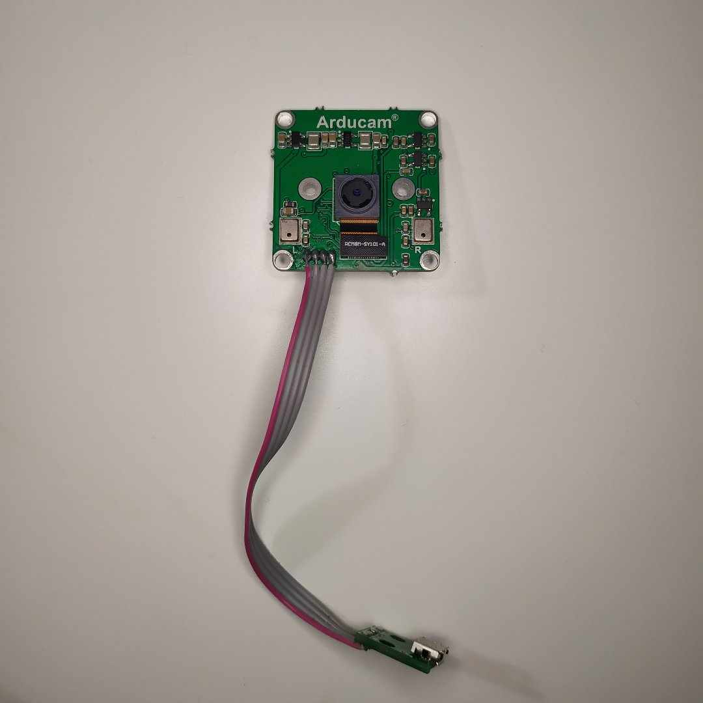
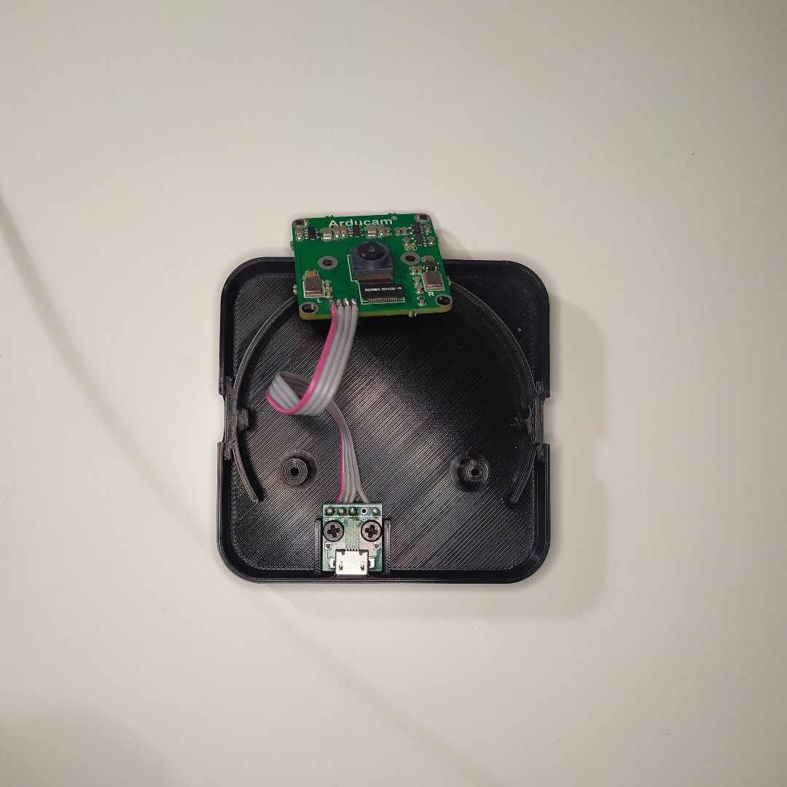
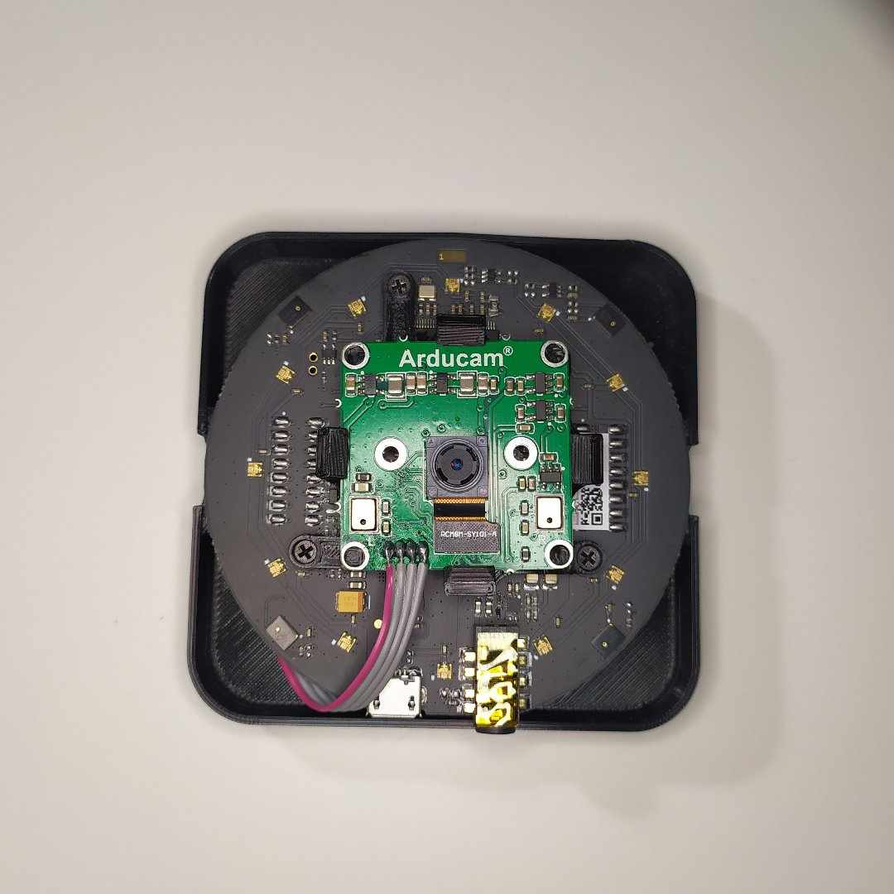

_Documentation release: October 5, 2023_

<p align="center">
 <picture>
  <source media="(prefers-color-scheme: dark)" srcset=".github/logo_dark_theme.svg" width="520">
  
 </picture>
</p>


EchoLense is an open-source acoustic camera made by [IntRoLab](https://introlab.3it.usherbrooke.ca/mediawiki-introlab/index.php/Main_Page). It aims to provide a flexible platform for the scientific community to further research in the field. It can be built with common off-the-shelf components and a 3D printer. This repo contains the STL files to build one as well as assembly instructions. We've also provided 1000 room impulse responses (RIRs) that we measured with the device and you'll find python scripts to measure your own too.

## Assembly instructions

### Bill of material

_We are not affiliated with any of the links provided below. Those are just examples of components similar to the ones we used._

<div align="center">

|         **Part**         | **Number** |                                              **URL**                                              |
|:------------------------:|:----------:|:-------------------------------------------------------------------------------------------------:|
|    3D printed housing    |      1     |               _See housing folder of this repo_       |
|    Arducam USB camera    |      1     |               [Link](https://ca.robotshop.com/products/arducam-8mp-1080p-usb-camera-module)      |
| ReSpeaker Mic Array v2.0 |      1     | [Link](https://ca.robotshop.com/products/seeedstudio-respeaker-mic-array-v20-far-field-4-pdm-microphones)|
|       M2x6mm screws      |      5     |                                                 -                                                 |
|       M3x4mm screws      |      2     |                                                 -                                                 |
| Micro USB to DIP adapter |      1     |          [Link](https://www.amazon.ca/Adapter-Female-Connector-Converter-pinboard/dp/B0CDBP341B/)         |
|   4-wires ribbon cable   |      1     |                                                 -                                                 |

</div>

### Instructions
1. Remove the camera's native USB connector.
2. Cut the ribbon cable so it has a length of around 90 mm and solder one of its ends to the camera's connector. Solder the other end of the cable to the micro USB to DIP adapter.

   <details>
    <summary><em>Illustration</em></summary>
    <p align="center">
     <picture>
      
     </picture>
    </p>
   </details>

4. Using the two M3x4mm screws, secure the micro USB to DIP adapter in the bottom of the housing.

   <details>
    <summary><em>Illustration</em></summary>
    <p align="center">
     <picture>
      
     </picture>
    </p>
   </details>

6. Insert the camera in its socket.
7. Place the mic array on top of the bottom part of the housing, place the camera on top of the mic array and secure everything using three M2x6mm screws.

   <details>
    <summary><em>Illustration</em></summary>
    <p align="center">
     <picture>
      
     </picture>
    </p>
   </details>


8. Close the housing and secure it using the last M2x6mm screws and the holes on the sides.

## Room impulse responses

### The "rirs" folder

To measure room impulse responses, we use the technique proposed in this paper:
Farina, Angelo. (2000). Simultaneous Measurement of Impulse Response and Distortion With a Swept-Sine Technique. 

In "rirs", you'll find three subfolders...

1. The "recordings" folder contains the exponential sine sweeps (ESS) recordings.
2. The "processings" folder contains the uncut room impulse responses obtained from the recordings.
3. The "toolkit" folder contains mainly two python scripts. The first one is `record.py`. It is used to produce and record ESSs and save them in the "recordings" folder. The second one is `process_recordings.py` and simply extracts the RIRs from the "recordings" folder and save them in the "processings" folder.

### Record new ESS
1. We recommend checking the parameters at the top of the `record.py` file to make sure that it fits your needs.
2. Launch the recording script:
   ```bash
   cd rirs
   python -m toolkit.record -o <output_folder> # output_folder will be created in the recordings directory
   ```
3. Start a recording by pressing the space bar on your keyboard.
4. Delete the last recording by pressing the "x" key on your keyboard.

### Extract RIRs from the recordings
 ```bash
 cd rirs
 python -m toolkit.process_recordings
 ```
